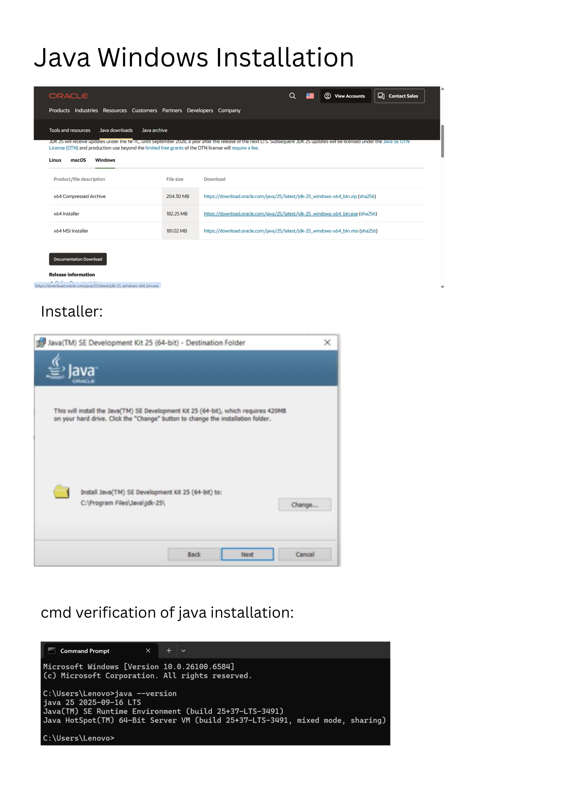
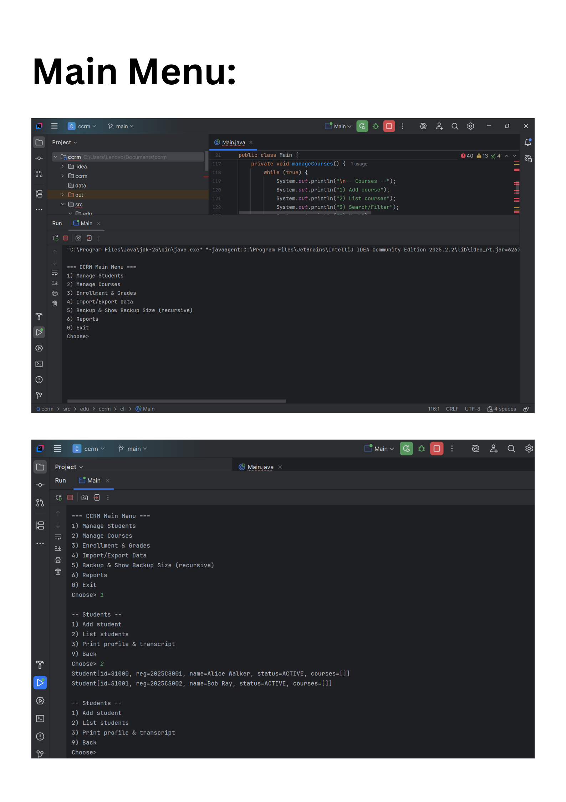
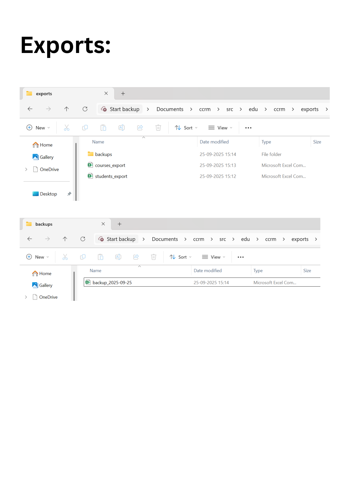

# Campus Course & Records Manager (CCRM)

## Project Overview
- CCRM is a console-based Java SE application that helps an institute manage:
- Students (create/update, enroll/unenroll in courses)
- Courses (create/update, list, search, assign instructors)
- Enrollments & Grades (record marks, compute GPA, print transcripts)
- File utilities (import/export data, backups using Java NIO.2)

---

## How to Run
- *JDK Version:* 25  
- *Steps:*
  1. Clone the repository:
     ```bash
     git clone https://github.com/tanishkas-ch/CCRM.git
     cd CCRM
  2. Open in *IntelliJ* or *Eclipse*.
  3. Run Main.java in edu.ccrm.cli.

---

## Windows Install & Setup
- Windows Install & Setup (with Screenshots)
1. JDK Installation
- Download and install JDK 25 from Oracle.
- Verify installation:
- java -version
- 
2. Eclipse Setup
- Open Eclipse -> File -> New -> Java Project -> Name it CCRM.
- Import cloned repository: File -> Import -> Existing Projects into Workspace -> Select CCRM.
- 
3. Running the Project
- Navigate to edu.ccrm.cli -> Run Main.java.
- 
4. Exports / Backups
- Check exports/ folder for sample CSV exports and backups.

---

## Notes on Assertions
- Enabled in EnrollmentService for credit checks.
- Run with assertions:
- java -ea -cp bin edu.ccrm.cli.Main

---

## Screenshots Folder Structure

- screenshots/
-  -> jdk_version.png
-  -> intellij_setup.png
-  -> main_menu.png
-  -> exports_folder.png

---

## Usage & Sample Commands

1. Import Students:
- -> import students.csv
2. Enroll Student:
- -> enroll 101 CSE101
3. Record Grades:
- -> record_grade 101 CSE101 88
4. Print Transcript:
- -> transcript 101
5. Use the test-data folder (test-data/) for sample CSV imports.

---
## Evolution of Java
- 1991 -Java project initiated by James Gosling & team at Sun Microsystems (originally called Oak).
- 1995 -Official release of Java 1.0 as a platform-independent, object-oriented language ("Write Once, Run Anywhere").
- 1998 -Release of Java 2 (J2SE, J2EE, J2ME) - introduction of Swing, Collections Framework, and enterprise features.
- 2004 -Java 5 (Tiger) introduced generics, annotations, enumerations, and the enhanced for-each loop.
- 2006 -Java released as open-source under GNU General Public License (GPL).
- 2009 -Oracle acquires Sun Microsystems, taking ownership of Java.
- 2011 -Java 7 adds try-with-resources, diamond operator, and fork/join framework.
- 2014 -Java 8 revolutionizes Java with lambdas, streams API, and default methods.
- 2017 -Java 9 introduces modules (Project Jigsaw).
- 2018 onwards -Shift to a 6-month release cycle (Java 10, 11, 12).
- 2018 (Java 11) -First Long-Term Support (LTS) release under Oracle's new model.
- 2021 (Java 17) -Latest LTS version with pattern matching, sealed classes, new HTTP client, etc.
- 2023 (Java 21) -Most recent LTS with virtual threads (Project Loom), record patterns, and other modern enhancements.


---

## Java Editions (ME vs SE vs EE)
| Edition | Purpose | Example Usage |
|---------|---------|---------------|
| *Java ME* | Micro Edition for small/embedded devices | Mobile apps (pre-Android era), IoT |
| *Java SE* | Standard Edition for desktop & console apps | CCRM project, desktop tools |
| *Java EE (Jakarta EE)* | Enterprise Edition for web & distributed systems | Banking, e-commerce platforms |

1. Java SE (Standard Edition)
- Core Java platform.
- Contains basic libraries (Collections, IO, Networking, Concurrency, JDBC, etc.).
- Used for desktop applications, console apps, and foundational development.


2. Java EE (Enterprise Edition) (now Jakarta EE)
- Built on top of Java SE.
- Adds APIs for large-scale, distributed, enterprise apps.
- Includes Servlets, JSP, EJB, JPA, Web Services, etc.
- Used for web apps, enterprise servers, cloud solutions.


3. Java ME (Micro Edition)
- Subset of Java SE for resource-constrained devices.
- Lightweight libraries optimized for mobile phones, embedded systems, IoT.
- Popular before Android era for mobile applications.


---

## ABOUT JDK, JRE, JVM
- *JDK* (Java Development Kit): Includes compiler (javac), tools, and JRE.
- *JRE* (Java Runtime Environment): Runs Java apps, contains JVM + libraries.
- *JVM* (Java Virtual Machine): Executes bytecode, platform-independent.

1. JVM (Java Virtual Machine)
- Executes Java bytecode on any platform.
- Provides platform independence ("Write Once, Run Anywhere").
- Handles memory management and garbage collection.


2. JRE (Java Runtime Environment)
- Includes JVM + core libraries required to run Java programs.
- Does not include tools to compile Java code.


3. JDK (Java Development Kit)
- Full toolkit for developing Java programs.
- Includes JRE + compiler (javac) + debugging tools + other utilities.

4. Flow:
- Java Source Code (.java) to JDK (compiles) to Bytecode (.class) to JVM executes using JRE

---
## Project Mapping

| Syllabus Topic     | Demonstration |
|--------------------|---------------|
| Encapsulation      | Student.java with private fields + getters/setters|
| Inheritance        | Person.java (abstract) with Student, Instructor|
| Abstraction        | Person.java with abstract methods|
| Polymorphism       | TranscriptService calling overridden toString()|
| Interfaces         | Searchable<T>|
| Nested Class       | Course.Builder (static nested)|
| enums              | Semester.java, Grade.java|
| Streams            | CourseService.java (filter/search)|
| Recursion          | BackupUtil.java (directory size calc)|
| Exception Handling | DuplicateEnrollmentException, MaxCreditLimitExceededException|
| Singleton          | AppConfig.java|
| Builder            | Course.Builder|
| Assertions         | In EnrollmentService (credit checks)|

---
## ScreenShots of Project





---


